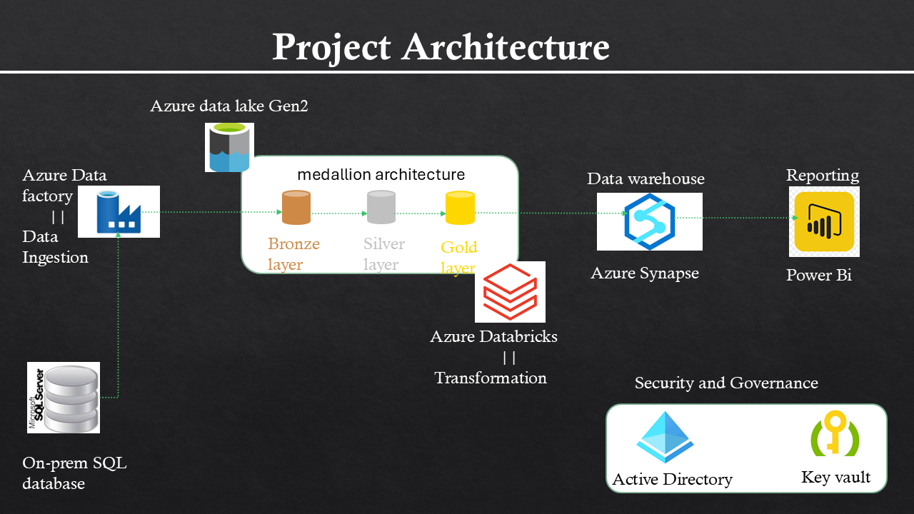
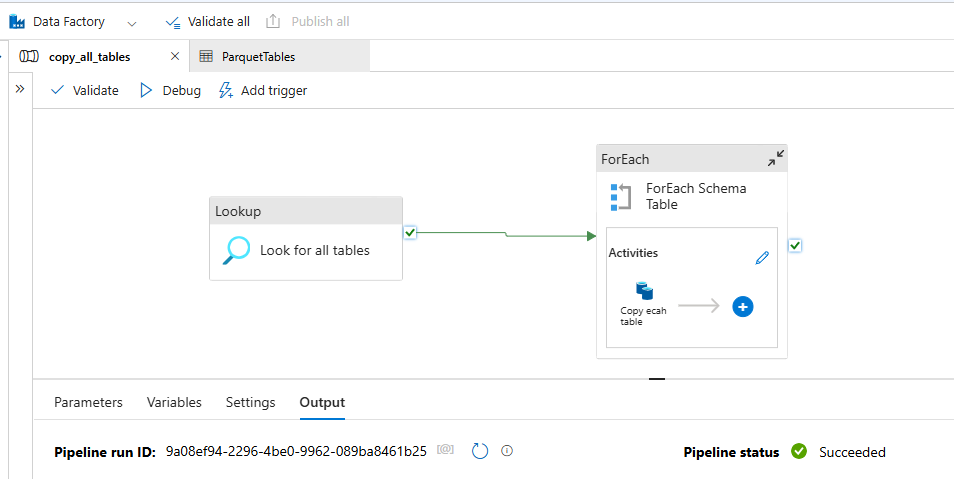
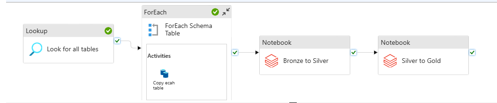

# Azure Data Engineering Pipeline

An end-to-end data pipeline built on Microsoft Azure, implementing the **Medallion Architecture** (Bronze → Silver → Gold) to ingest, transform, and serve enterprise data from an on-premises SQL Server.

---

## Architecture



---

## Tech Stack

| Layer | Tool |
|---|---|
| Ingestion | Azure Data Factory |
| Storage | Azure Data Lake Storage Gen2 |
| Transformation | Azure Databricks (PySpark) |
| Serving | Azure Synapse Analytics |
| Security | Azure Key Vault + Microsoft Entra ID |

---

## Pipeline Overview

### 1. Ingestion — On-Prem to Bronze
- Configured a **Self-Hosted Integration Runtime** to connect Azure Data Factory to an on-premises SQL Server running the AdventureWorks2017 database.
- Built an ADF pipeline to copy all tables into the **Bronze** layer of ADLS Gen2 as Parquet files.



### 2. Transformation — Bronze to Silver
- Mounted ADLS Gen2 containers in Azure Databricks using Azure AD passthrough authentication.
- Standardized all date columns to `yyyy-MM-dd` format using PySpark.
- Wrote cleaned data to the **Silver** layer in Delta format.

### 3. Transformation — Silver to Gold
- Renamed all columns from `PascalCase` to `snake_case` for consistency.
- Saved final tables to the **Gold** layer in Delta format — ready for analytics.



### 4. Serving — Gold to Synapse
- Created a stored procedure in **Azure Synapse Analytics** that dynamically generates serverless SQL views pointing to the Gold Delta Lake tables.
- Views can be connected to any BI tool (e.g. Power BI, Tableau) for reporting and dashboards.

---

## Project Files

```
├── notebooks/
│   ├── storagemount.py          # Mounts bronze/silver/gold ADLS containers in Databricks
│   ├── bronze_to_silver.py      # Date standardization transformation
│   └── silver_to_gold.py        # snake_case column renaming transformation
├── scripts/
│   └── CreateSQLServerlessView_gold.sql   # Synapse stored procedure for dynamic views
└── screenshots/                 # Architecture and pipeline screenshots
```

---

## Prerequisites

- Active Azure subscription
- SQL Server (on-premises or local) with the AdventureWorks2017 database loaded
- Azure Data Lake Storage Gen2 account with bronze, silver, and gold containers

---

## How to Run

1. **Load the database** — Set up AdventureWorks2017 on your local SQL Server instance. You can download it from the [Microsoft official samples](https://github.com/Microsoft/sql-server-samples/releases/tag/adventureworks).
2. **Set up ADF** — Create a Self-Hosted Integration Runtime and configure the copy pipeline to push tables to the Bronze layer.
3. **Mount storage in Databricks** — Run `storagemount.py` with your ADLS account details.
4. **Run transformations** — Execute `bronze_to_silver.py` then `silver_to_gold.py` in Databricks.
5. **Create Synapse views** — Run `CreateSQLServerlessView_gold.sql` in your Synapse serverless pool.

---

## Acknowledgements

Built as a hands-on learning project exploring Azure's data engineering ecosystem and the Medallion Architecture pattern.